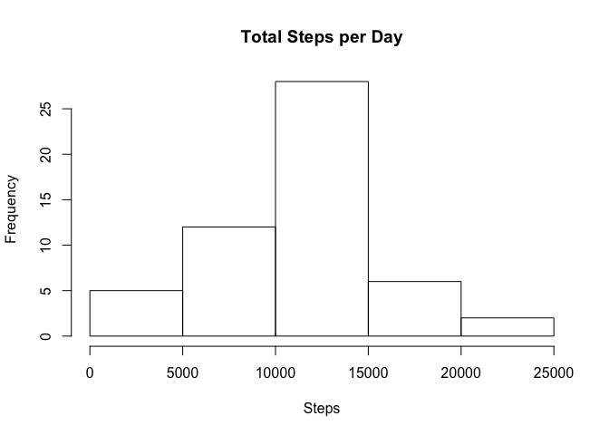
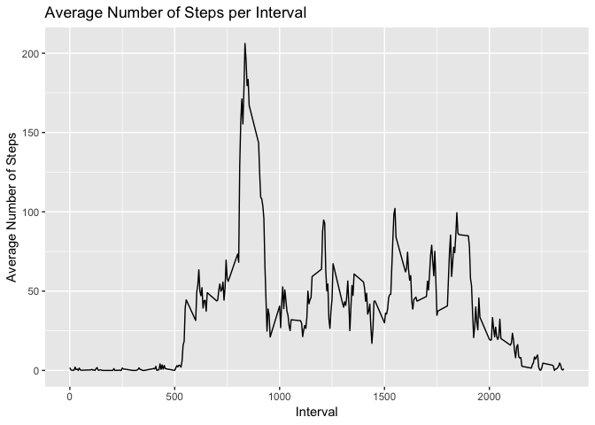
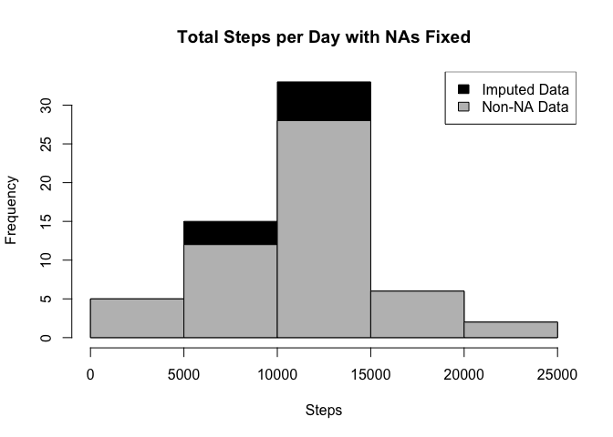
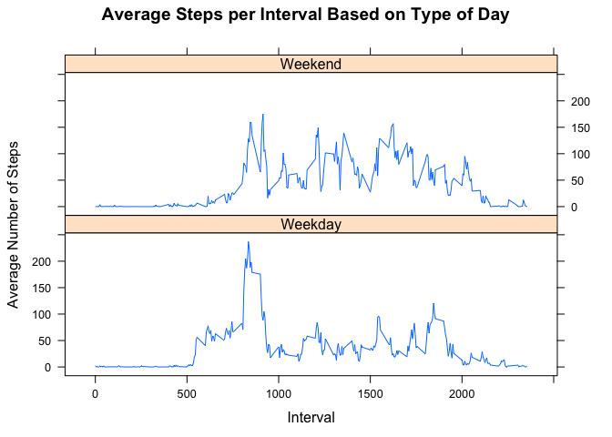

## Global Seting for codes


```r
library(knitr)
opts_chunk$set(cash = TRUE, echo = TRUE, results ='show')
```

## Loading and preprocessing the data

1. Loading data 

```r
activity <- read.csv("activity.csv")
```

2. Process/transform the data into a format suitable for the analysis

```r
activity$day <- weekdays(as.Date(activity$date))
activity$DateTime<- as.POSIXct(activity$date, format="%Y-%m-%d")

## removing NAs
clean <- activity[!is.na(activity$steps),]
```

## What is mean total number of steps taken per day?
Calculate the total number of steps taken per day

## What is mean total number of steps taken per day?

1. Calculate the total number of steps taken per day


```r
sumTable <- aggregate(activity$steps ~ activity$date, FUN=sum, )
colnames(sumTable)<- c("Date", "Steps")
```


2. Make a histogram of the total number of steps taken each day


```r
hist(sumTable$Steps, breaks=5, xlab="Steps", main = "Total Steps per Day")
```

<!-- -->

3. Calculate and report the mean of the total number of steps taken per day

```r
## Mean of Steps
as.integer(mean(sumTable$Steps))
```

```
## [1] 10766
```

4. Calculate and report the median of the total number of steps taken per day

```r
## Median of Steps
as.integer(median(sumTable$Steps))
```

```
## [1] 10765
```


## What is the average daily activity pattern?

1. Make a time series plot (i.e. type = "l) of the 5-minute interval (x-axis) and the average number of steps taken, averaged across all days (y-axis)


```r
library(plyr)
library(ggplot2)

##create average number of steps per interval
intervalTable <- ddply(clean, .(interval), summarize, Avg = mean(steps))

##Create line plot of average number of steps per interval
p <- ggplot(intervalTable, aes(x=interval, y=Avg), xlab = "Interval", ylab="Average Number of Steps")
p + geom_line()+xlab("Interval")+ylab("Average Number of Steps")+ggtitle("Average Number of Steps per Interval")
```

<!-- -->


2. Which 5-minute interval, on average across all the days in the dataset, contains the maximum number of steps?


```r
##Maximum steps by interval
maxSteps <- max(intervalTable$Avg)
##Which interval contains the maximum average number of steps
intervalTable[intervalTable$Avg==maxSteps,1]
```

```
## [1] 835
```

## Imputing missing values

1. Calculate and report the total number of missing values in the dataset (i.e. the total number of rows with NAs)


```r
nrow(activity[is.na(activity$steps),])
```

```
## [1] 2304
```

2. Devise a strategy for filling in all of the missing values in the dataset.

My strategy for filling in NAs will be to substitute the missing steps with the average 5-minute interval on each day of the week.

```r
## Create the average number of steps per weekday and interval
avgTable <- ddply(clean, .(interval, day), summarize, Avg = mean(steps))

## Create dataset with all NAs
nadata <- activity[is.na(activity$steps),]

## Merge two dataset to substit NAs
NAsubsitut <-merge(nadata, avgTable, by=c("interval", "day"))
```

3. Create a new dataset that is equal to the original dataset but with the missing data filled in.


```r
## Reorder the new substituded data in the same format as clean data set
newdata<- NAsubsitut[,c(6,4,1,2,5)]
colnames(newdata)<- c("steps", "date", "interval", "day", "DateTime")

##Merge the NA averages and non NA data together
mergeData <- rbind(clean, newdata)
```

4. Make a histogram of the total number of steps taken each day and Calculate and report the mean and median total number of steps taken per day. Do these values differ from the estimates from the first part of the assignment? What is the impact of imputing missing data on the estimates of the total daily number of steps?
Are there differences in activity patterns between weekdays and weekends?


```r
##Create sum of steps per date to compare with step 1
sumTable2 <- aggregate(mergeData$steps ~ mergeData$date, FUN=sum, )
colnames(sumTable2)<- c("Date", "Steps")

## Mean of Steps with NA data taken care of
as.integer(mean(sumTable2$Steps))
```

```
## [1] 10821
```

```r
## Median of Steps with NA data taken care of
as.integer(median(sumTable2$Steps))
```

```
## [1] 11015
```

```r
## Creating the histogram of total steps per day, categorized by data set to show impact
hist(sumTable2$Steps, breaks=5, xlab="Steps", main = "Total Steps per Day with NAs Fixed", col="Black")
hist(sumTable$Steps, breaks=5, xlab="Steps", main = "Total Steps per Day with NAs Fixed", col="Grey", add=T)
legend("topright", c("Imputed Data", "Non-NA Data"), fill=c("black", "grey") )
```

<!-- -->

However, the overall shape of the distribution has not changed after subsitution of NA values.
However, The new mean and median of the imputed data is slightly higher than the old calculated values. the difference is 55 steps on average per day for mean and 250 for median.

## Are there differences in activity patterns between weekdays and weekends?

1. Create a new factor variable in the dataset with two levels – “weekday” and “weekend” indicating whether a given date is a weekday or weekend day.


```r
mergeData$DayCategory <- ifelse(mergeData$day %in% c("Saturday", "Sunday"), "Weekend", "Weekday")
```


2. Make a panel plot containing a time series plot (i.e. type = "l") of the 5-minute interval (x-axis) and the average number of steps taken, averaged across all weekday days or weekend days (y-axis). 


```r
library(lattice) 
## Summarize data by interval and type of day
intervalTable2 <- ddply(mergeData, .(interval, DayCategory), summarize, Avg = mean(steps))
##Plot data in a panel plot
xyplot(Avg~interval|DayCategory, data=intervalTable2, type="l",  layout = c(1,2),
       main="Average Steps per Interval Based on Type of Day", 
       ylab="Average Number of Steps", xlab="Interval")
```

<!-- -->

There are differences in the activity patterns between weekdays and weekends. 
